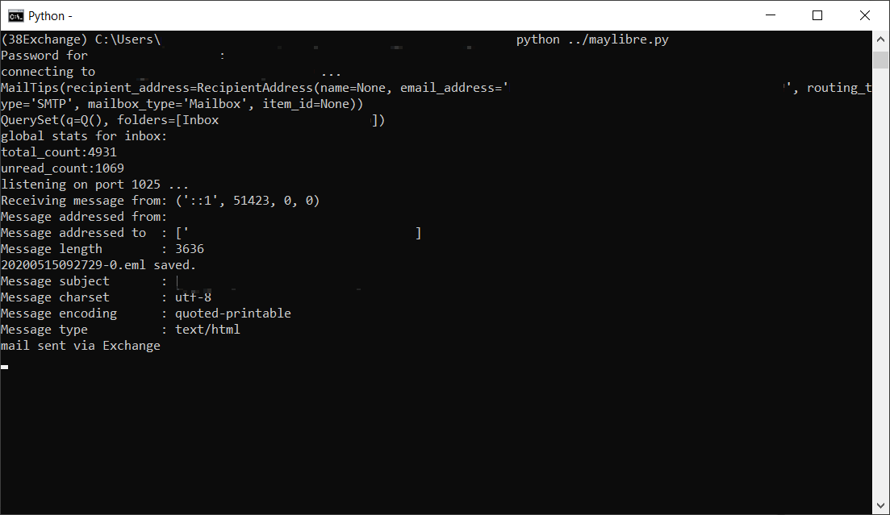

<h2 align="center">
    MayLibre
</h2>
<h3 align="center">
    Eases mailing from LibreOffice to an Exchange server
</h3>
<h4 align="center">
  <a href="#description">Description</a> |
  <a href="#installation">Installation</a> |
  <a href="#usage">Usage</a> |
  <a href="#tests">Tests</a> |
  <a href="#licensing">Licensing</a> |
  <a href="#credits">Credits</a> |
  <a href="#release-history">Release History</a>
</h4>

## Description

If you ever wanted to :

* send mass mailing from [LibreOffice](https://www.libreoffice.org/)
* not setup a smtp server
* rely on [Exchange Web Server](https://en.wikipedia.org/wiki/Microsoft_Exchange_Server)

this script is made for you !



This script runs as a local smtp server, allowing to use mass mailing in LibreOffice, but sends all emails via an Exchange Web Server, just as if you were using it directly from LibreOffice.

Of course, if your server already exposes smtp, you don't need it.

This script does almost nothing, all work is done by the [exchangelib](https://pypi.org/project/exchangelib/) package. This script just glue together a local smtp server and the exchange server.


## Installation

To install MayLibre, prefer to do so in a virtual environment, then activate it. You can install (wherever you like) :

```
pip install https://github.com/tudstlennkozh/maylibre/zipball/master
```

That's it ! All required packages are installed.

## Usage

Just run the maylibre module. At first invocation, it will ask for configuration :

    python -m maylibre
    no config file, please fill in missing values
    server(mail server name):mail.server.com
    email(email address for account):first.name@server.com
    username(like DOMAIN\login):SERVER\name
    eml_directory(dir where to put .eml of emails sent, leave empty if you don't want a local copy):C:\Temp\Emails
    configuration saved in C:\Users\...\test\maylibre.cfg

Then enter the password associated with the account

```
Password for SERVER\name:******
connecting to mail.server.com ...
```

and proceed to LibreOffice to send all your emails via your local smtp server directly connected to EWS.

Just type `Ctrl+C` to end the script when done. Configuration is saved for next invocation (except password). Please note the path, you may need to modify it in the future : if you want to change configuration, just edit the generated `maylibre.cfg` file or delete it to relaunch questions at next run.

## Tests

This script has been tested on :

| OS               | Python                                                       | LibreOffice                                                  | Tests  |
| ---------------- | ------------------------------------------------------------ | ------------------------------------------------------------ | ------ |
| Windows 10       |   | 6.4 | passed |
| WSL/Ubuntu 18.04 |  | 6.4 | passed |

Please let us know if any other environment is working.

* as a python exec inside LO ?
* allow to enter %USERPROFILE% env. var in path ?

You can also find some clues in [Troubleshootings.md](/Troubleshootings.md)

## Licensing

[](/LICENSE)

Licensed under the Apache License, Version 2.0 (the "License"); you may not use this file except in compliance with the License. You may obtain a copy of the License at 

http://www.apache.org/licenses/LICENSE-2.0

Unless required by applicable law or agreed to in writing, software distributed under the License is distributed on an "AS IS" BASIS, WITHOUT WARRANTIES OR CONDITIONS OF ANY KIND, either express or implied. See the License for the specific language governing permissions and limitations under the License.

## Credits

Nothing would have been possible without [exchangelib](https://pypi.org/project/exchangelib/).

## Release History

Please refer to the included [CHANGELOG](/CHANGELOG.md) for the full release history.

-------------------------
###### © 2020 tudstlennkozh

